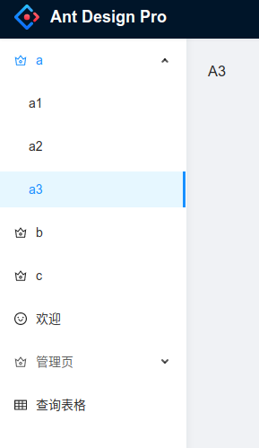
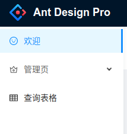
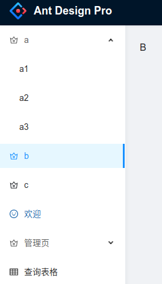
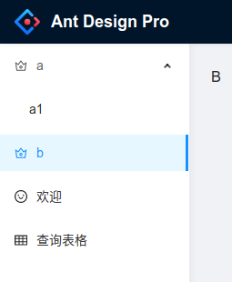
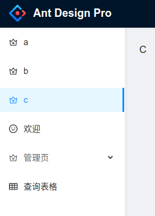

# 问题描述

## 工程创建

创建复现项目

```bash
yarn create umi antd-v5-top-menu-not-hide
# 选ant-design-pro
# 选Pro V5
cd antd-v5-top-menu-not-hide
yarn

## 出现提示
## Couldn't find any versions for "omit.js" that matches "^2.0.0"
## ? Please choose a version of "omit.js" from this list: 1.0.2
## 选1.0.2
```

在`src/pages`目录下创建测试页面，目录结构如下：

```bash
src/pages
├── a
│   ├── a1
│   │   └── index.tsx
│   ├── a2
│   │   └── index.tsx
│   └── a3
│       └── index.tsx
├── b
│   └── index.tsx
├── c
    └── index.tsx
```

每个`index.tsx`的内容都是一个简单的`<h1>`标签，只是内容改为对应的字母而已：

```typescript
import React from 'react';

export default () => {
  return (
    <h1>
      A1 {/* 其它页面的内容是A2, A3, B, C */}
    </h1>
  );
};
```

在`config/config.ts`中添加路由：

```typescript
routes: [
    {
      path: '/a',
      name: 'a',
      icon: 'crown',
      routes: [
        {
          path: '/a/a1',
          name: 'a1',
          component: './a/a1/index',
        },
        {
          path: '/a/a2',
          name: 'a2',
          component: './a/a2/index',
        },
        {
          path: '/a/a3',
          name: 'a3',
          component: './a/a3/index',
        },
      ],
    },
    {
      path: '/b',
      name: 'b',
      icon: 'crown',
      component: './b/index'
    },
    {
      path: '/c',
      name: 'c',
      icon: 'crown',
      component: './c/index'
    },
]
```

页面显示如下：



## 实现动态显示菜单

由于`src/app.tsx`中的`getInitialState`方法会初始化全局数据，这里会调用`/api/currentUser`接口初始化用户可访问的菜单

1. 所以我在该接口返回的数据中加多一个字段`accessableMenus`:

```typescript
declare namespace API {
  export interface CurrentUser {
    accessableMenus?: string[] ////////// 加入该字段
    avatar?: string;
    name?: string;
    title?: string;
    group?: string;
    signature?: string;
    tags?: {
      key: string;
      label: string;
    }[];
    userid?: string;
    access?: 'user' | 'guest' | 'admin';
    unreadCount?: number;
  }  
}
```

2. 其次还要修改`mock/user.ts`中`/api/currentUser`返回的mock数据，`admin用户返回所有菜单的代码，user只返回部分菜单的代码`：

```typescript

// 代码中会兼容本地 service mock 以及部署站点的静态数据
export default {
  // 支持值为 Object 和 Array
  'GET /api/currentUser': (req: Request, res: Response) => {
    if (!getAccess()) {
      res.status(401).send({
        data: {
          isLogin: false,
        },
        errorCode: '401',
        errorMessage: '请先登录！',
        success: true,
      });
      return;
    }
    
    //////////////// 加入这段代码
    let accessableMenus: string[];
    if (getAccess()==='admin'){
      // 如果是admin登录, 该用户可访问所有菜单
      accessableMenus = ['a','a1','a2','a3','b','c']
    } else if( getAccess()==='user'){
      // 如果是user, 只可访问部分菜单
      accessableMenus = ['a','a1','b']
    }else{
      // 其它用户不能访问abc这些菜单，只能访问公共的菜单
      accessableMenus = []
    }
    //////////////// 加入这段代码
    
    res.send({
      accessableMenus, //////////////// 返回的CurrentUser加入该字段，表示当前登录用户可访问的菜单
      name: 'Serati Ma',
      // .........
    });
  },
    
  // .........

  'GET  /api/login/captcha': getFakeCaptcha,
};
```

3. 在`src/access.ts`中加入自定义的`menuFilter`：

```typescript
// src/access.ts

export default function access(initialState: { currentUser?: API.CurrentUser | undefined }) {
  const { currentUser } = initialState || {};
  return {
    canAdmin: currentUser && currentUser.access === 'admin',
    // 多问一个问题, 这里回调的route具体是什么类型?
    menuFilter: (route) => {
      // initialState 中包含了的路由才有权限访问
      console.log('menuFilter, currentUser.accessableMenus: %o, route.name: %o',currentUser?.accessableMenus,route.name)
      return currentUser
        && currentUser.accessableMenus
        && currentUser.accessableMenus.includes(route.name)
    },
  };
}
```

4. 回到路由配置`config/config.ts`中添加路由：，加入`access: 'menuFilter'`：

```typescript
   routes: [
    {
      path: '/a',
      name: 'a',
      access: 'menuFilter', ////// 根据CurrentUser.accessableMenus过滤
      icon: 'crown',
      routes: [
        {
          path: '/a/a1',
          name: 'a1',
          access: 'menuFilter', ////// 根据CurrentUser.accessableMenus过滤
          component: './a/a1/index',
        },
        {
          path: '/a/a2',
          name: 'a2',
          access: 'menuFilter', ////// 根据CurrentUser.accessableMenus过滤
          component: './a/a2/index',
        },
        {
          path: '/a/a3',
          name: 'a3',
          access: 'menuFilter',////// 根据CurrentUser.accessableMenus过滤
          component: './a/a3/index',
        },
      ],
    },
    {
      path: '/b',
      name: 'b',
      access: 'menuFilter',////// 根据CurrentUser.accessableMenus过滤
      icon: 'crown',
      component: './b/index'
    },
    {
      path: '/c',
      name: 'c',
      access: 'menuFilter',////// 根据CurrentUser.accessableMenus过滤
      icon: 'crown',
      component: './c/index'
    },
]
```

## 测试复现问题

`yarn start`启动项目

### 问题1：登录后首次渲染菜单，没法按配置的权限显示

**登录前F5手动刷新页面**，然后登录，无论是admin还是user，登陆后首次渲染页面的菜单，都无法按配置显示菜单

*admin登录后：*



*admin登录后手动F5刷新页面后：*



*user登录后：*


*user登录后手动F5刷新页面后：*



### 问题2：菜单显示上一次用户登录的菜单，当前登录用户没权限的菜单无法隐藏

复现步骤：

1. **登录前F5手动刷新页面**

2. admin登录

3. F5刷新

4. admin退出

5. user登录

6. 问题复现：上一次登录的用户admin能看到`a, a1, a2, a3, b, c` ; 而本次登录用户user只配置了能访问`a, a1, b`，但是页面上能看到，如下图：

   


